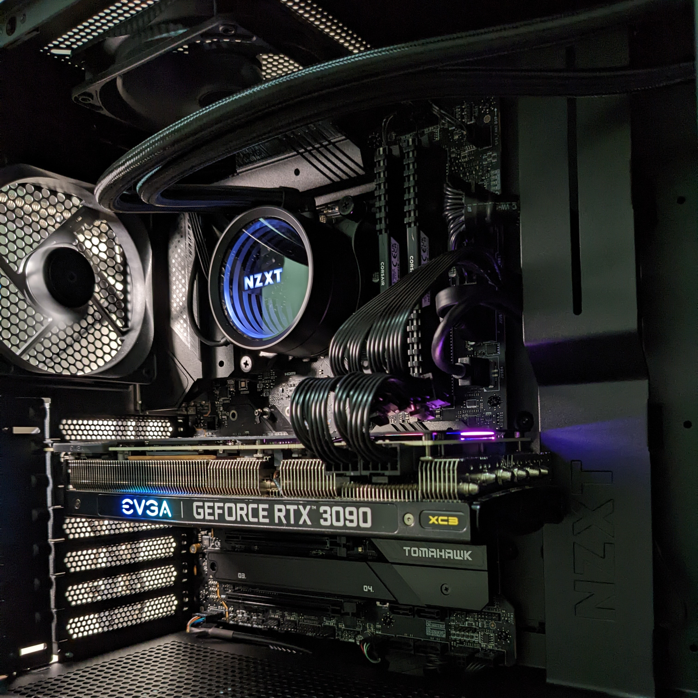
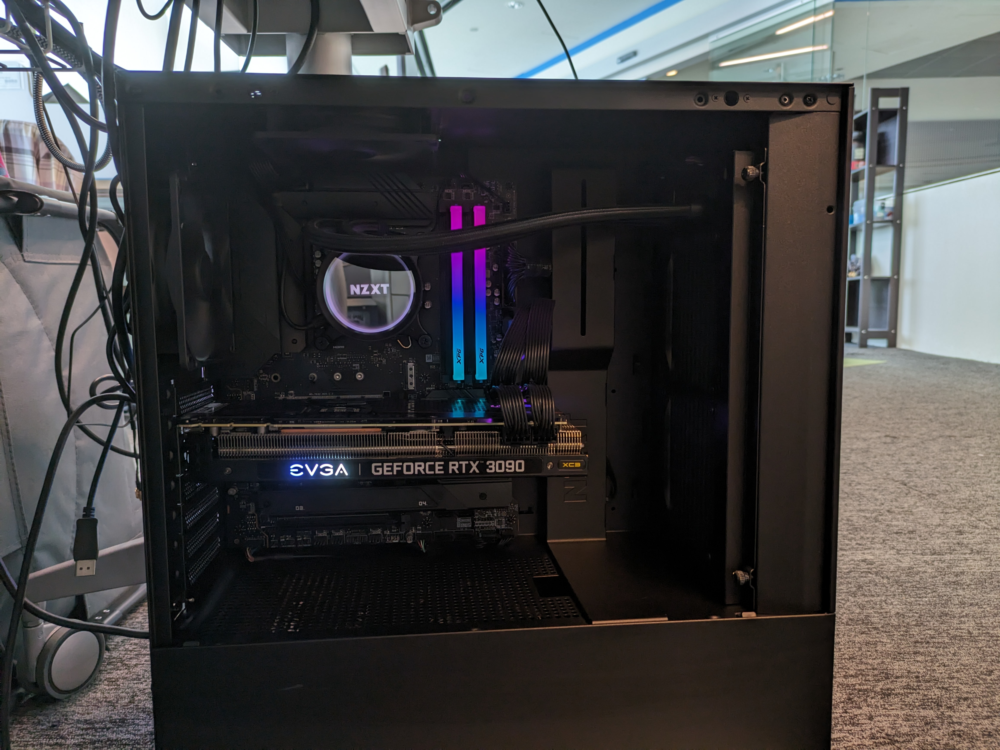
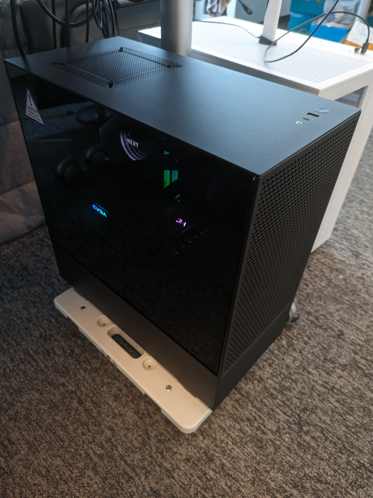
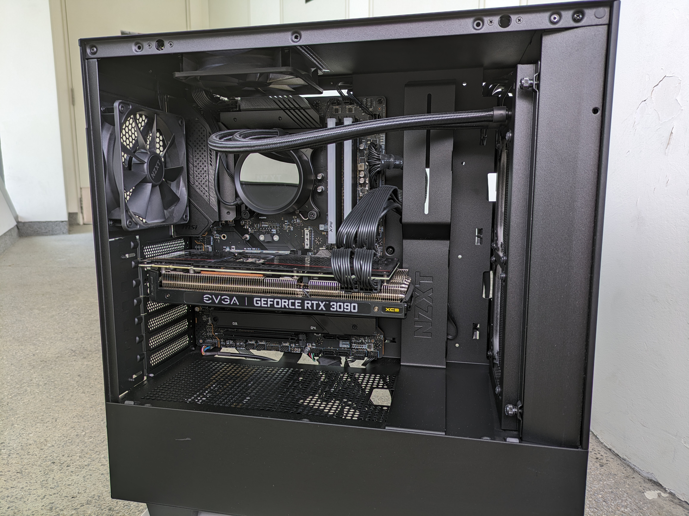

# One-year-old PC for Sale

I am selling my one-year-old custom-built PC. The PC is in excellent condition and has been well taken care of.

Key features:

-   Intel i7-12700K (12 Cores, 5.0 GHz)
-   RTX 3090 (24 GB VRAM)
-   32GB Memory (3600 MHz)
-   2TB NVMe SSD

What's NOT included:

-   No monitor, keyboard, or any peripherals included.
-   No Windows license included. (Currently running Ubuntu 22.04.3 LTS, I can help you install Windows if you want.)

About warranty:

This is a custom-built PC by myself. The parts for this PC were purchased from Amazon US, Amazon SG, and Amazon JP. The parts are covered by the manufacturer's warranty. I can provide most (not all) of the components' receipts and the original packaging if needed.

## Price

-   Original cost: S$3,500+ (components cost only)
-   **Now Selling at: S$1,500**

(The 3090 alone should be worth this price. It is a good deal.)

## Detailed Specifications

Perfect for gaming, and deep learning. Extremely quite and cool.

|    Parts    | Model                                      | Specs                                                 |
| :---------: | :----------------------------------------- | :---------------------------------------------------- |
|    Case     | NZXT H510 Flow                             | Black, Tempered Glass Side Panel                      |
| Motherboard | MSI MAG Z690 TOMAHAWK WIFI                 | ATX, LGA 1700, DDR4, PCIe 4, CFX, M.2, Wi-Fi 6E       |
|     CPU     | Intel Core **i7-12700K**                   | 12 Cores (8 Performance + 4 Efficiency) up to 5.0 GHz |
|     GPU     | EVGA GeForce **RTX 3090** XC3 Ultra Gaming | 24GB GDDR6X, iCX3 Cooling, ARGB LED                   |
|     RAM     | ADATA XPG GAMMIX D45G **32GB RAM**         | DDR4, **3600MHz**, 32GB (16GBx2), RGB                 |
|   Storage   | Lexar NM710 **2TB SSD**                    | PCIe Gen4 NVMe M.2                                    |
|     PSU     | SeaSonic FOCUS PLUS 850W 80+ Gold          | Full-Modular, 80+ Gold Certified                      |
| CPU Cooler  | NZXT Kraken X53 CPU Liquid Cooler          | 40mm AIO RGB, Rotating Infinity Mirror Design         |

## Photos

All photos below were taken on November 11, 2023, showing the current condition.

